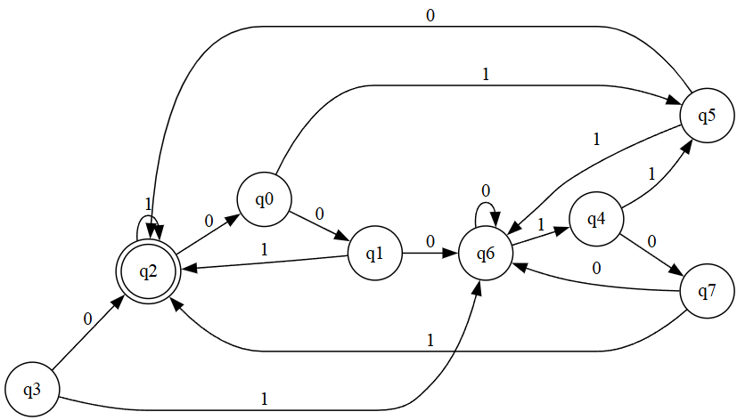
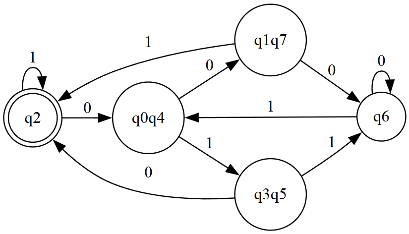

# Практика 8

> **Задание:** построить ДКА, минизировать его и построить МДКА.

### Начальное условие

|    |  0 |  1 |
|----|---:|---:|
| q0 | q1 | q5 |
| q1 | q6 | q2 |
| q2 | q0 | q2 |
| q3 | q2 | q6 |
| q4 | q7 | q5 |
| q5 | q2 | q6 |
| q6 | q6 | q4 |
| q7 | q6 | q2 |

## Решение

### 1. Граф ДКА

### 2. Минимизированный КА

|      |   0  |   1  |
|------|:----:|:----:|
| q0q4 | q1q7 | q3q5 |
| q1q7 | q6   | q2   |
| q2   | q0q4 | q2   |
| q3q5 | q2   | q6   |
| q6   | q6   | q0q4 |

### 3. Граф МДКА

